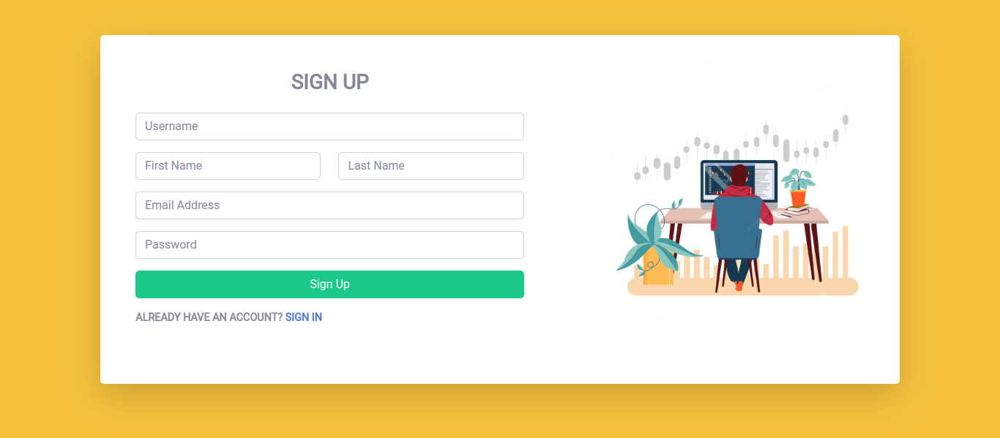
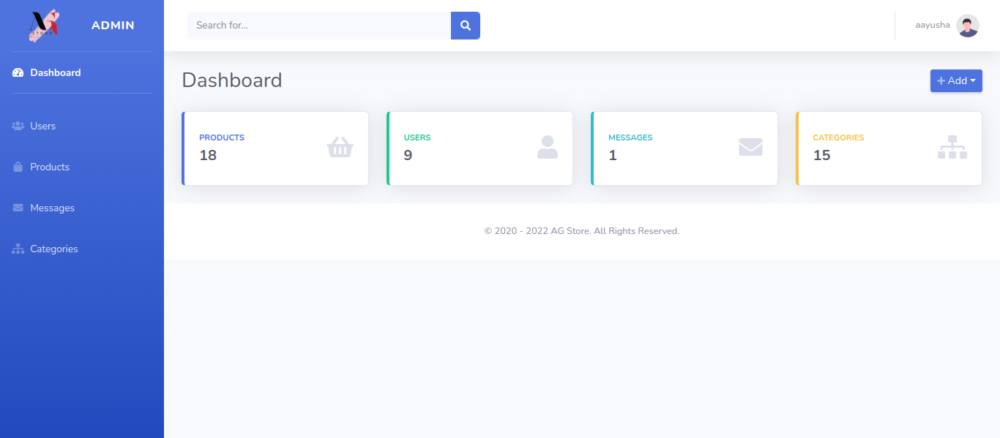
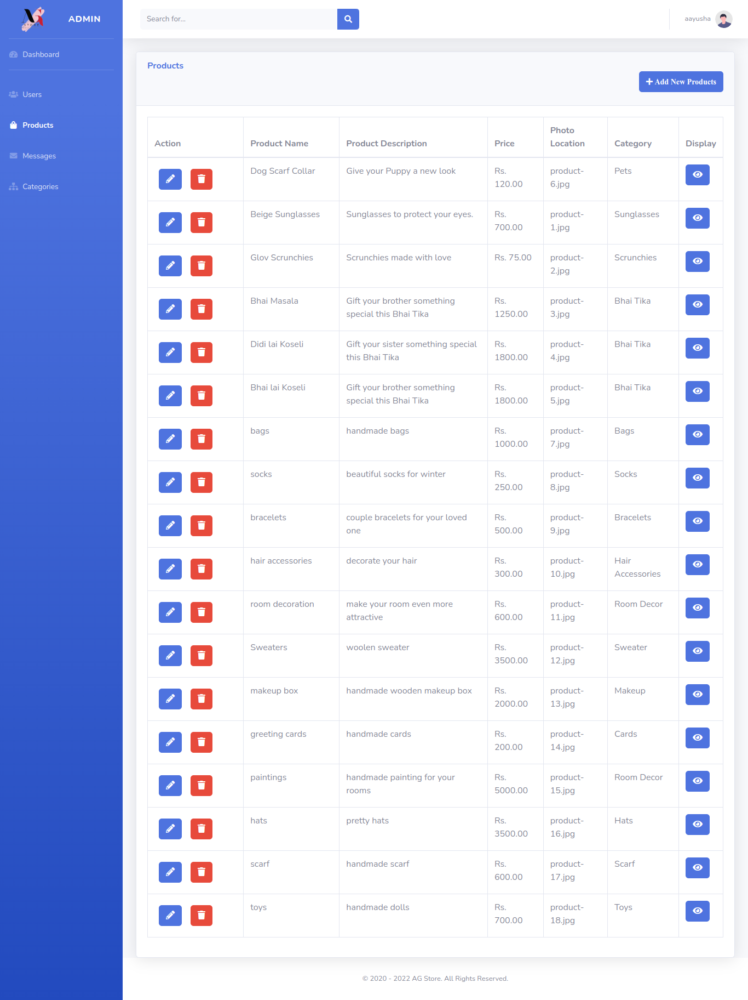
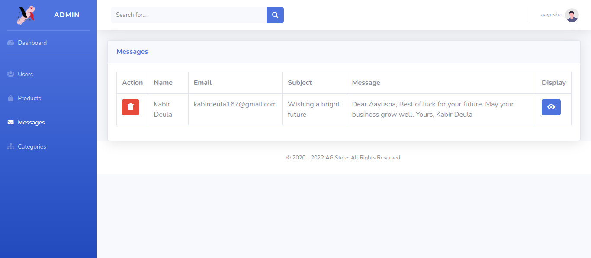

<h2 align="center">AG Store</h2>

Always and Forever

## About AG Store

AG-Store is an online store that sells high-quality handmade things at an affordable price. When you buy artisan-crafted items, you're also supporting the artisans' craft talent. In general, something that is machine made is something that is made in large quantities. Handmade items are always handcrafted with a lot of love, care, and attention to detail in order to create something unique. Handmade items are always crafted with a lot of love, care, and attention to detail in order to create something unique and treasured.

## Technologies Used

### Frontend

### Backend

## Contributors

---

## Screenshot

### Index

### About

### Contact

### Shop

### Login

### Register

### Admin Index

### Admin Users

#### Create Users

#### Read Users

#### Update Users

---

### Admin Products

#### Create Product

#### Read Product

#### Update Product

---

### Admin Messages

#### Read Message

---

### Admin Categories

#### Create Category

#### Read Category

#### Update Category

---